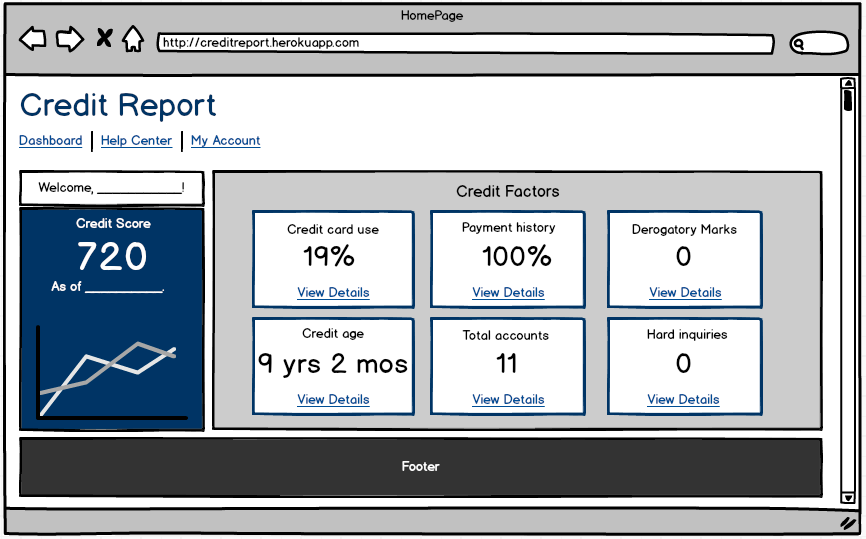
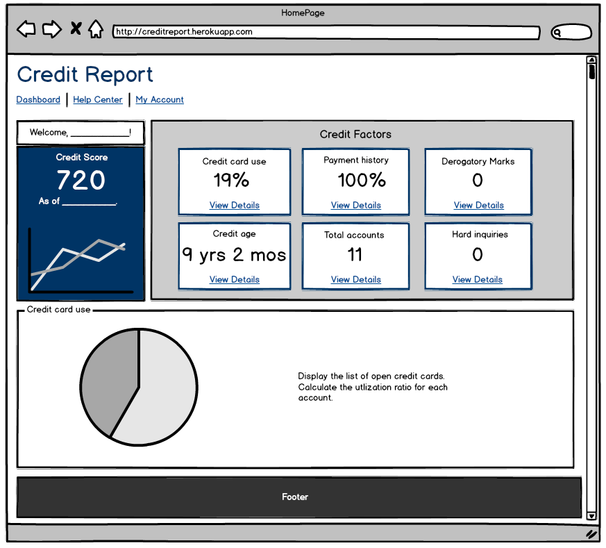
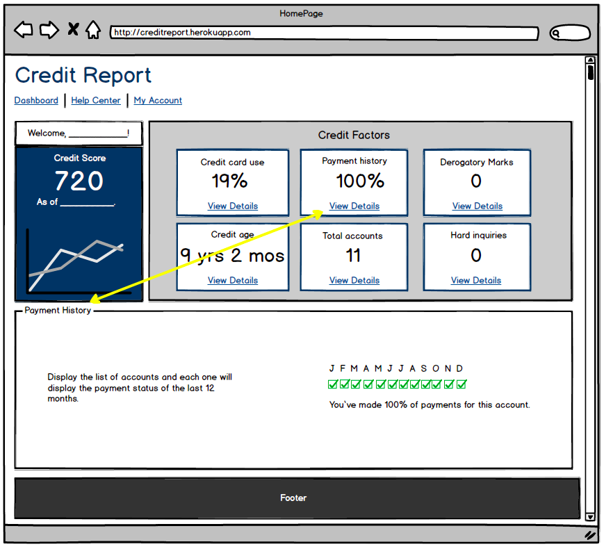
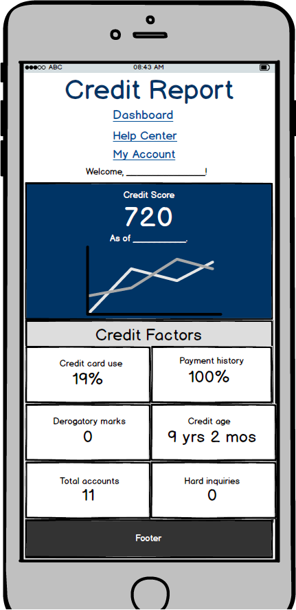
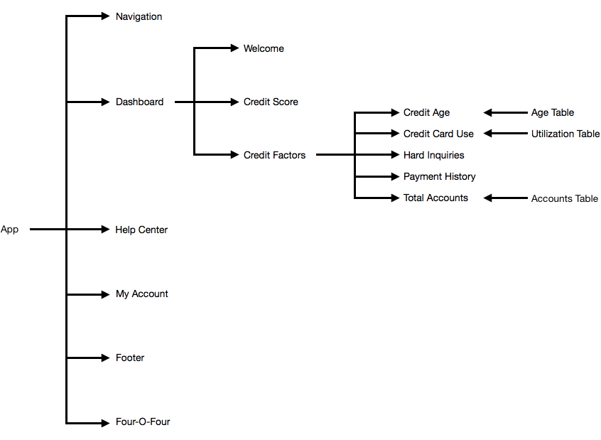
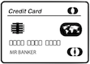

General Assembly | Final Project

# Credit Report

<a name="tableofcontents">

### Table of Contents

1. [Project Proposal](./proposal.md)
2. [GitHub Board](https://github.com/francheska-guzman/credit-report/projects#boards?repos=93885730)
3. [User Stories](#userstories)
4. [Browser Wireframes](#browser)
5. [Mobile Wireframes](#mobile)
6. [Visual representation of the database](#database)
7. [React Components](#components)
8. [Pseudocode](#pseudocode)
9. [Technologies Used](#technologies)
10. [See the Project](#project)

</a>

<a name="userstories">

## User Stories

1. As a user who doesn't know what is a Credit Report, and the impact of it in my life; I would like to get information about it, including quick tips for my credit health.
2. As a user, I would like instructions on how to use the website.
3. As a user, I want to get my credit score and a histogram chart to see how my score has changed over the time.
4. As a user interested in get a credit report, I would like to see the following credit factores: 
	• Credit card use 
	• Payment history 
	• Derogatory marks 
	• Credit age 
	• Total accounts 
	• Hard inquiries
5. As a user, I would like a clean dashboard with colorful charts to visualize my financial situation.
6. As a user, I want to protect my personal and financial data by using a login. (Post MVP 😅)

</a>

<a name="browser">

## Browser Wireframes

Dashboard overview:

If the user click "View Details" in any of the six (6) credit factors, the page will render the information in the same page. In this example, the user clicked "View Details" for credit card use.

This is another example. Here, the user press "View Details" for payment history.

My account (render user basic information):

</a>

<a name="mobile">

## Mobile Wireframes

</a>

<a name="database">

## Visual representation of the database

</a>

<a name="components">

## React Components

These are the components and how they are related.

</a>

<a name="pseudocode">

## Pseudocode

1. Make an axios call to the Credit Report API, and get the personal and financial information from an especific user.
2. Find the credit use and credit limit for each account open account.
3. Divide credit use by the credit limit, to compute the utilization ratio.
4. Render the result in the Credit Card Use component in the following format: Credit name, Account Type, Credit Use, Credit Limit and the ratio already computed. (Utilization ratio for each account.)
5. Finally, sum the credit use of all accounts, sum the credit limit of all accounts, and divide it. Render the result in a pie chart. (Utilization ratio in general.)

</a>

<a name="technologies">

## Technologies Used

### Core Stack:

- HTML
- CSS
- JavaScript
- React
- Node
- Express
- PostgreSQL
- Heroku
- GitHub

### APIs:

[Credit Report API](https://creditreportapi.herokuapp.com/) - I created this API to add personal and financial information for users, that I will be using to calculate their credit factors and credit score. This is not a final API, I will be adding more data and tables. Inmediatly I made changes to the database, I will be updating the "[Visual representation of the database](#database)".

### Middleware:

- Libraries to create responsive charts: [ChartJS](http://www.chartjs.org/), [ChartistJS](http://gionkunz.github.io/chartist-js/), [Fusion Charts](http://www.fusioncharts.com/) and/or [Google Charts](https://developers.google.com/chart/).

### Other sources:

- [balsamiq](https://balsamiq.com/) for the wireframes.

- [logomakr](https://logomakr.com/) to create credit card, personal loan, student loan, auto loan, home loan, and business loan logos: 

          

</a>

<a name="project">

## See the Project

### Life Deployment of Credit Report App: https://francheska-guzman.github.io/credit-report

### Life Deployment of Credit Report API: https://creditreportapi.herokuapp.com/

</a>

#### [Go Back: Table of Contents](#tableofcontents)