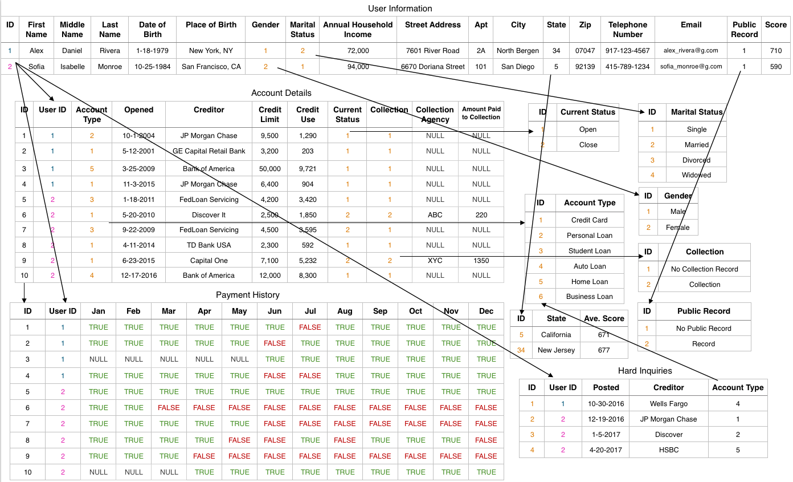

**Francheska Guzman | GA Final Project**

# Credit Report

### Table of Contents

1. [Project Proposal](./proposal.md)
2. [Time Management](#timemanagement)
3. [User Stories](#userstories)
4. [Browser Wireframes](#browser)
5. [Mobile Wireframes](#mobile)
6. [Visual representation of the database](#database)
7. [Flowchart](#flowchart)
8. [Pseudocode](#pseudocode)
9. [Technologies used](#technologies)

<a name="timemanagement">

### Time Management

[GitHub Board](https://github.com/francheska-guzman/credit-report/projects#boards?repos=93885730)

</a>

<a name="userstories">

### User Stories

1. As a user who doesn't know what is a Credit Report, and the impact of it in my life; I would like to get information about it, including quick tips for my credit health.
2. As a user, I want to get my credit score.
3. As a user interested in get a credit report, I would like to see the following credit factores: 
	• Credit card use 
	• Payment history 
	• Derogatory marks 
	• Credit age 
	• Total accounts 
	• Hard inquiries
4. As a user, I would like a clean dashboard with colorful charts to visualize my financial situation.

</a>

<a name="browser">

### Browser Wireframes

</a>

<a name="mobile">

### Mobile Wireframes

</a>

<a name="database">

### Visual representation of the database

</a>

<a name="flowchart">

### Flowchart

</a>

<a name="pseudocode">

### Pseudocode

</a>

<a name="technologies">

### Technologies Used

1. React for the Client-side
2. Node/Express App for the Server-side
3. Relational Database using PostgreSQL
4. Libraries to create responsive charts: [ChartJS](http://www.chartjs.org/), [ChartistJS](http://gionkunz.github.io/chartist-js/), [Fusion Charts](http://www.fusioncharts.com/) and/or [Google Charts](https://developers.google.com/chart/).

</a>

